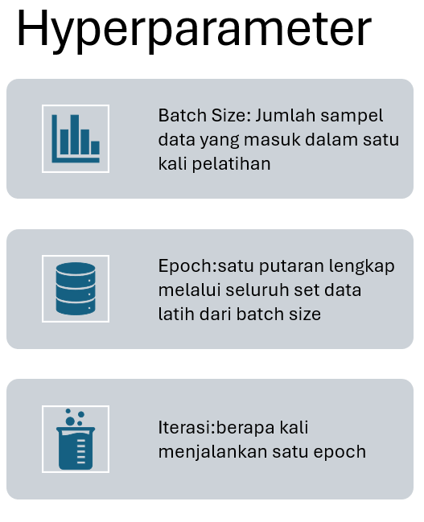

# Hyperparameter

Teori Menjelaskan :
* Definisi Hyperparameter
* Iterasi
* Epoch
* Batch Size

## Pengembangan Dataset

Kembangkan dataset dengan topik masing masing yang dipilih

## Optimasi Hyperparameter

Tentukan nilai nilai dan hitung akurasi dari setiap hyperparameter yang diubah

## Kerjakan

1. Pilih topik dataset yang akan dikembangkan, tidak boleh sama dengan yang lain
2. Topik kordinasi dengan ketua kelas dan kelas lainnya jangan sampai sama
3. Jalankan file training.py berdasarkan hyperparameter yang ditentukan
4. Output dari training menghasilkan satu buah model, buatlah kode program python untuk me load model tersebut kemudian meminta inputan dari user dan outputan dari hasil model
5. Ukur akurasi dari setiap inputan dan outputan model tersebut per hyperparameter kemudian di rekap dalam spreadsheet
6. Jelaskan setiap error yang didapatkan ketika menjalankan program, berikut solusi untuk mengatasinya