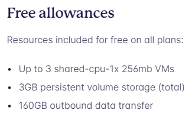

# Deploy Web Service Model AI

Tugas kali ini adalah :
1. Gabungkan semua data set yang dibuat satu kelas menjadi satu data csv besar, kemudian latihlah model dengan dataset yang sudah dibuat satu kelas tersebut
2. Hasil latih berupa model di bagikan dan di gunakan bersama di web service yang dibuat masing masing(nilai 10)
3. Setiap individu membuat webservice model AI yang telah di latih dengan dataset bersama di fly.io, gunakan free tier dari fly.io(nilai 40)  
     
4. Setiap individu membuat frontend di github pages yang menggunakan webservice model AI sebagai backend(nilai 40)
5. Web Service dan Frontend berjalan tanpa ada error(nilai 10)